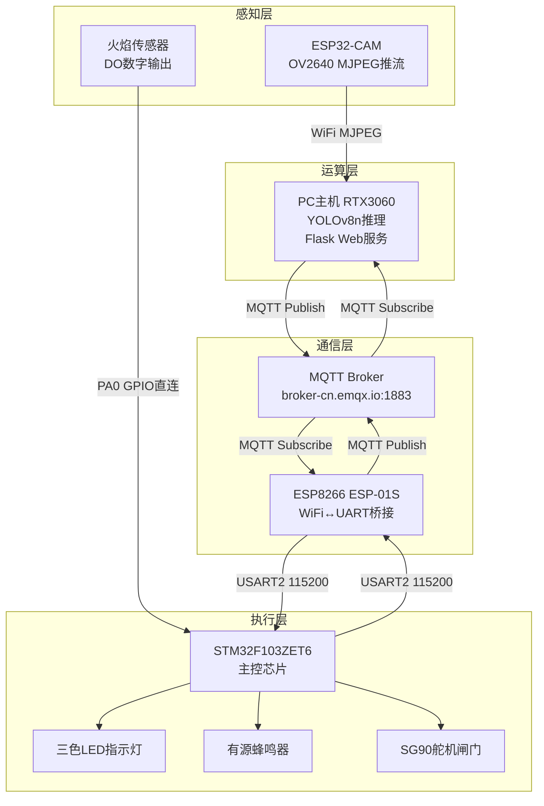
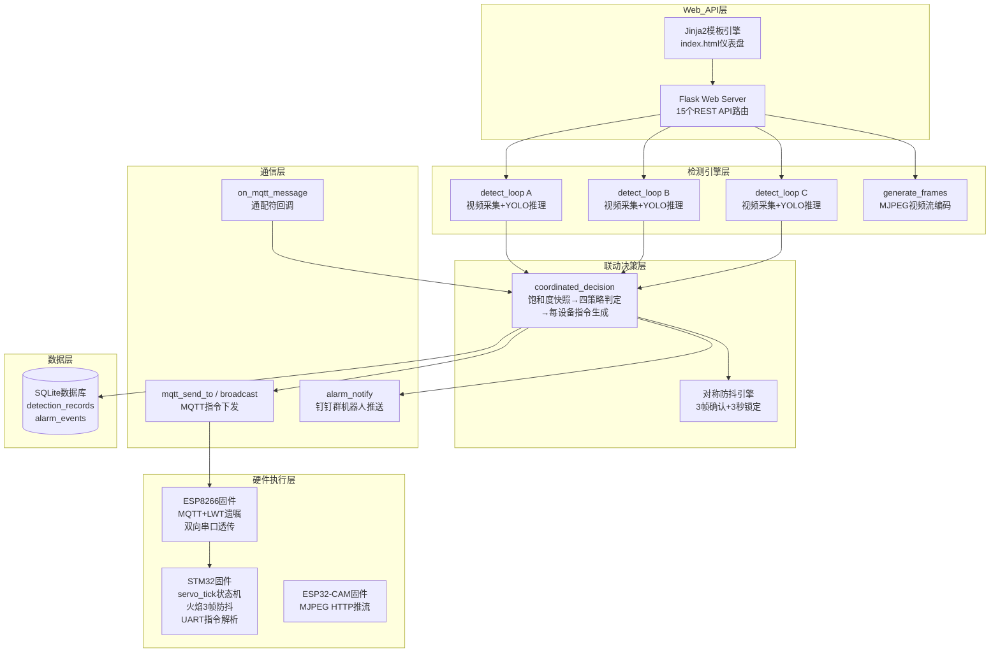
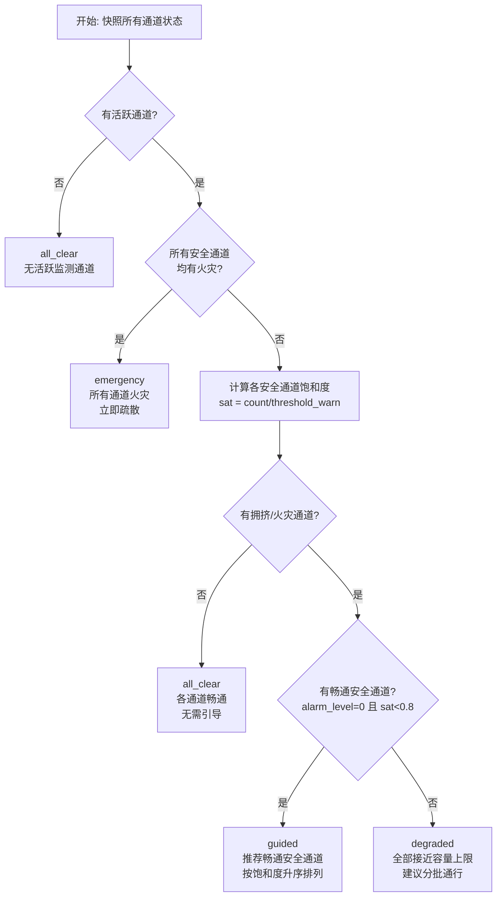
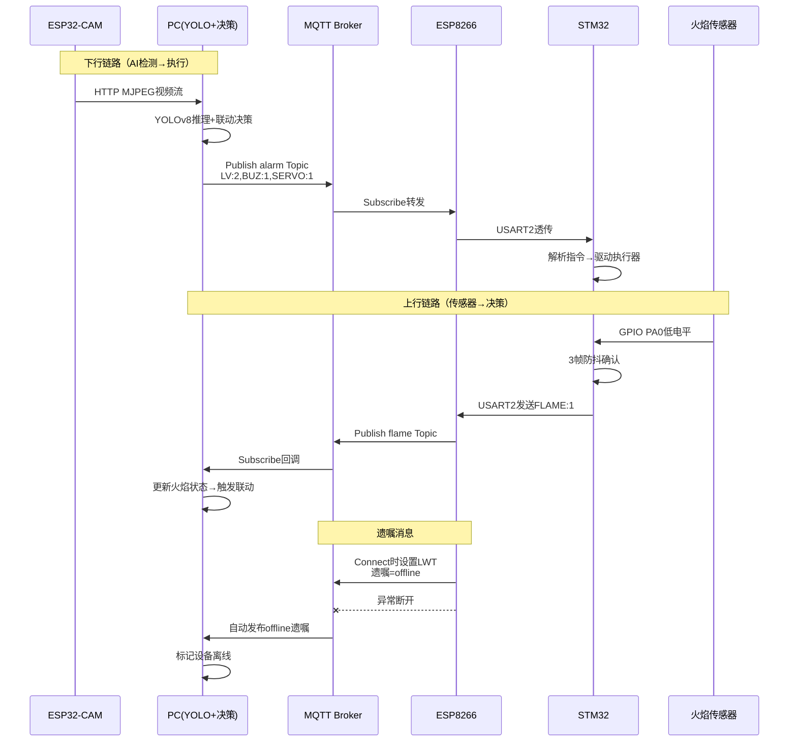

# 第3章 系统设计

## 3.1 系统总体架构

### 3.1.1 设计目标与原则

　　本系统的核心设计目标是构建一套面向应急场景的校园人流量监控与引导管理系统，能够在正常通行和火灾等紧急情况下，对教学楼多出口通道进行实时监测、智能评估与联动控制。系统的设计遵循以下基本原则：

　　（1）**双输入冗余**。系统同时接入远程AI视觉检测通道与本地火焰传感器物理检测通道，形成异构互补的感知体系。远程AI通道通过摄像头捕捉视频流并由深度学习模型进行人员计数，实现对通道人流密度的精确感知；本地火焰传感器直接接入STM32微控制器，不依赖网络和PC主机即可独立响应，确保在网络中断或PC宕机的极端情况下，火灾应急机制依然有效。

　　（2）**实时性优先**。从视频帧采集到YOLOv8推理再到MQTT指令下发至STM32执行器，端到端延迟控制在1秒以内。三通道检测线程采用相位错开启动策略，避免GPU计算资源竞争导致的延迟抖动。

　　（3）**可扩展性**。系统采用基于MQTT协议的多设备通配符订阅机制，支持动态发现和接入新的STM32执行器设备。各监测通道独立启停、独立配置阈值、独立切换视频源，可灵活适配不同教学楼出口的物理布局。

　　（4）**低成本部署**。除PC主机（用于YOLO推理）外，硬件选型均为低成本嵌入式模组：ESP32-CAM（约30元）、ESP8266 ESP-01S（约8元）、STM32F103ZET6开发板（约40元）、SG90舵机（约5元）、火焰传感器模块（约3元），整系统硬件成本控制在百元级别。

　　（5）**应急双态模式**。系统仪表盘具备正常态与应急态两种UI模式。当任意通道触发火灾报警或全局手动报警时，仪表盘自动切换为应急模式：顶部栏变红、折线图折叠、推荐面板放大突出，实现"平时静默监控，急时醒目指挥"的设计理念。

### 3.1.2 系统物理架构

　　系统的物理架构由四个层次的硬件设备组成，自下而上分为感知层、运算层、通信层与执行层，如图3-1所示。

　　感知层包括ESP32-CAM摄像头模组和火焰传感器。ESP32-CAM搭载OV2640图像传感器，以MJPEG格式通过WiFi推送实时视频流至PC端；火焰传感器模块通过DO数字输出引脚直接连接STM32的PA0端口，低电平有效，独立于网络链路。

　　运算层为一台搭载NVIDIA RTX 3060（6GB显存）的PC主机，运行Python后端程序。后端程序通过HTTP协议持续拉取ESP32-CAM的MJPEG码流，手动解析JPEG帧边界后送入YOLOv8n模型进行人员检测，对每帧画面输出人员数量和检测框坐标。

　　通信层以MQTT协议为核心，broker部署于云端（broker-cn.emqx.io:1883）。PC端通过paho-mqtt库发布控制指令和系统状态；ESP8266 WiFi模块作为通信桥接器，将MQTT消息通过UART（USART2, 115200bps 8N1）透传至STM32，同时将STM32上报的火焰传感器状态通过MQTT回传至PC。

　　执行层以STM32F103ZET6为核心控制器，驱动三色LED指示灯（黄灯PE5、红灯PB5）、有源蜂鸣器（PB8）和SG90舵机闸门（PA6, TIM3 CH1 PWM）。

<b>图3-1 系统物理架构图</b>

　　图3-1中需要注意的是，火焰传感器的信号链路（火焰→STM32→ESP8266→MQTT→PC）与AI视觉链路（摄像头→PC→MQTT→ESP8266→STM32）形成了闭环。但火焰传感器的本地响应（火焰→STM32→舵机/蜂鸣器）是独立于网络的——当火焰传感器触发时，STM32在本地直接驱动执行器，同时上报状态至PC，两条路径并行而非串行依赖。

### 3.1.3 系统软件架构

　　系统软件采用分层模块化架构，从上到下分为Web API层、检测引擎层、联动决策层、通信层和硬件执行层。各层之间通过明确的接口调用，上层不直接依赖下层实现细节。系统软件架构如图3-2所示。

<b>图3-2 系统软件架构图</b>

　　**线程模型**。系统运行在多线程架构下，共5个核心线程：

| 线程 | 数量 | 说明 |
|------|:---:|------|
| Flask主线程 | 1 | 处理HTTP请求，渲染仪表盘页面，响应15个API路由 |
| 检测线程（detect_loop） | 3 | 每个通道一个独立线程，负责视频读取、YOLO推理、报警防抖、数据库写入、触发联动决策 |
| MQTT网络线程 | 1 | paho-mqtt的loop线程，处理MQTT消息的收发与回调 |

　　三通道检测线程是系统的核心工作线程。每线程以约50ms为周期（20fps上限）循环执行：读帧→缩放到320×240→YOLOv8n推理→人员计数→报警防抖判断→DB写入→触发联动决策。每0.3秒调用一次`coordinated_decision()`进行全局联动判定。三个检测线程在启动时按A:0ms、B:16.7ms、C:33.3ms的相位偏移错开，避免同时竞争CUDA推理资源和全局解释器锁（GIL）。

　　MQTT线程由paho-mqtt库内部管理，通过回调函数`on_mqtt_message`处理来自各STM32设备的status和flame消息，更新设备在线状态和火焰传感器状态。联动决策函数在锁保护下读取这些状态进行全局判定。

---

## 3.2 硬件系统设计

### 3.2.1 硬件选型与参数

　　本系统的硬件选型围绕"低成本、可复制、易扩展"的原则展开。考虑到教学楼多出口场景的部署需求，所有硬件组件均为市售通用模组，无需定制开发。各组件选型理由与关键参数如表3-1所示。

<b>表3-1 硬件组件选型清单与关键参数</b>

| 组件 | 型号 | 核心参数 | 作用 | 单价 |
|------|------|---------|------|:---:|
| AI摄像头 | ESP32-CAM (AI-THINKER) | ESP32-S, OV2640传感器, 520KB SRAM + 4MB PSRAM, WiFi 802.11b/g/n | 视频采集MJPEG推流 | ~30元 |
| WiFi桥接 | ESP8266 ESP-01S | Tensilica L106 32-bit, 80MHz, WiFi 802.11b/g/n | MQTT透传PC↔STM32 | ~8元 |
| 主控MCU | STM32F103ZET6 | ARM Cortex-M3, 72MHz, 64KB SRAM, 512KB Flash | 执行器控制核心 | ~40元 |
| 图像传感器 | OV2640 | 200万像素, UXGA(1600×1200), 支持JPEG压缩输出 | 集成于ESP32-CAM | — |
| 舵机 | SG90 (360°连续旋转) | 4.8-6V, 50Hz PWM, 扭矩1.5kg·cm | 模拟闸门开合 | ~5元 |
| 火焰传感器 | 红外接收管模块 | 探测波长760-1100nm, DO数字输出, 低电平触发 | 火灾检测 | ~3元 |
| 蜂鸣器 | 有源蜂鸣器模块 | 3.3-5V, 约2300Hz | 声音警报 | ~2元 |
| AI运算 | PC (RTX 3060 Laptop) | 6GB GDDR6, 3840 CUDA Cores | YOLOv8n推理 | — |

　　对于ESP32-CAM的摄像头配置，采用了30MHz XCLK频率配合QVGA（320×240）分辨率的组合。30MHz高于OV2640标准最高频率（20MHz），通过传感器硬件上下电复位和SCCB软复位使PLL重新锁定，实测稳定运行且帧率达到20fps以上。JPEG压缩质量设为8（0-63范围），在保证AI检测可用的图像质量前提下最大程度减小网络传输数据量。

　　SG90舵机选用360°连续旋转型号，区别于常见的180°角度舵机。连续旋转舵机通过PWM脉宽控制转速和方向：1ms脉宽对应正向全速旋转，1.5ms对应停止，2ms对应反向全速旋转。这一特性使其非常适合模拟闸门的开合动作。

### 3.2.2 STM32 引脚分配与电路连接

　　STM32F103ZET6的GPIO引脚分配围绕六类外设展开：LED状态指示、蜂鸣器报警、火焰传感器输入、舵机PWM控制、ESP8266 UART通信和调试串口。完整引脚映射如表3-2所示。

<b>表3-2 STM32F103ZET6 引脚映射表</b>

| 外设 | 引脚 | 端口模式 | 功能说明 |
|------|------|---------|---------|
| 黄灯LED | PE5 | GPIO_Output PP | 黄色预警指示（LV=1时闪烁，LV=2时常亮） |
| 红灯LED | PB5 | GPIO_Output PP | 红色报警指示（LV=2时常亮） |
| 蜂鸣器 | PB8 | GPIO_Output PP | 声音报警（LV≥1时触发） |
| 火焰传感器 | PA0 | GPIO_Input Pull-up | DO数字输入，低电平=检测到火焰 |
| 舵机PWM | PA6 | GPIO_AF_PP (TIM3_CH1) | 50Hz PWM控制舵机转速和方向 |
| ESP8266 RX | PA2 | USART2_TX | STM32→ESP8266 数据发送 |
| ESP8266 TX | PA3 | USART2_RX | ESP8266→STM32 数据接收 |
| 调试TX | PA9 | USART1_TX | 串口调试输出（预留） |
| 调试RX | PA10 | USART1_RX | 串口调试输入（预留） |

　　ESP8266与STM32之间的UART连接采用交叉接线方式：ESP8266的TX引脚连接STM32 USART2的RX（PA3），ESP8266的RX连接STM32 USART2的TX（PA2），通信参数为115200bps、8数据位、无校验、1停止位（8N1）。两模块共地，ESP8266由STM32板上3.3V供电。

　　火焰传感器模块的VCC接3.3V、GND接地、DO接PA0。传感器内部比较器在检测到火焰红外信号超过阈值时将DO引脚拉低。STM32端配置PA0为输入模式并使能内部上拉电阻，确保无火焰时读到高电平。

### 3.2.3 执行器控制设计

　　执行器控制系统包含三个输出维度：LED视觉指示、蜂鸣器听觉警报和舵机物理闸门。三级输出定义如表3-3所示。

<b>表3-3 三级报警输出定义</b>

| 等级 | 名称 | 触发条件 | 黄灯(PE5) | 红灯(PB5) | 蜂鸣器(PB8) | 舵机(PA6) |
|:---:|------|---------|:---:|:---:|:---:|:---:|
| LV0 | 正常 | 人数≤黄色阈值 | 灭 | 灭 | 灭 | 关闭 |
| LV1 | 黄色预警 | 黄色阈值<人数≤红色阈值 | 闪烁 | 灭 | 灭 | 关闭 |
| LV2 | 红色报警 | 人数>红色阈值 或 火灾触发 | 常亮 | 常亮 | 响 | 打开 |

　　**舵机PWM控制**。舵机由TIM3定时器的通道1（PA6）驱动，配置参数如下：定时器时钟源为64MHz经128分频得到500kHz计数频率，自动重载值设为10000-1得到50Hz PWM频率（符合SG90标准）。CCR1捕获/比较寄存器的值控制脉宽，三个关键值映射关系如式（3-1）所示：

<b>CCR1值 = 脉宽 × 计数频率</b>

<b>式（3-1）</b>

　　具体而言：CCR1=250对应1ms脉宽（正转全速）、CCR1=750对应1.5ms脉宽（停止）、CCR1=1250对应2ms脉宽（反转全速）。实际开门使用CCR1=300（略大于250以克服静摩擦），关门使用CCR1=1200。舵机动作采用非阻塞状态机实现，通过全局变量`servo_state`跟踪当前状态（0=空闲、1=开门中、2=关门中），主循环每轮调用`servo_tick()`检查动作是否达到1200ms持续时长，到期后将CCR1恢复至750停止位置。这一设计确保舵机动作不阻塞火焰传感器轮询和UART消息处理。

　　**火焰报警优先级**。在STM32固件的`set_outputs()`函数设计中，火焰传感器报警具有最高优先级。当`flame_alarm=1`时，`set_outputs(2)`直接驱动全部输出，且MQTT下发的指令（`LV:*,BUZ:*,SERVO:*`）不会覆盖当前输出状态。只有当火焰传感器恢复正常（`flame_alarm`复位为0）后，输出状态才恢复到MQTT上次下发的等级。

### 3.2.4 多场景模拟方案

　　受实物条件限制，系统实际拥有1个ESP32-CAM摄像头、1个舵机、1个火焰传感器和1个蜂鸣器。为验证三通道联动的系统设计，本文采用"物理共享+逻辑独立"的多场景模拟方案，使有限硬件支撑三个通道的并行模拟。模拟策略如表3-4所示。

<b>表3-4 多场景模拟策略表</b>

| 组件 | 实物数量 | 模拟策略 | 逻辑数量 |
|------|:---:|------|:---:|
| 摄像头 | 1 | 3路MP4本地视频文件替代ESP32-CAM实时流（A通道可切换MJPEG实物） | 3路虚拟 |
| 舵机 | 1 | 物理舵机共享，三通道OR逻辑控制（任一通道需开门即开） | 1个共享 |
| 火焰传感器 | 1 | 固定绑定至A通道（实物），B/C通道通过前端模拟按钮触发 | 1实物+2模拟 |
| 蜂鸣器 | 1 | 物理蜂鸣器共享，三通道OR逻辑控制（任一通道报警即响） | 1个共享 |

　　视频采集方面，系统检测引擎支持MJPEG实时流和MP4本地文件两种视频源类型的运行时切换。三通道在自动模式下各自从videos/目录按通道前缀匹配视频文件（如`channel_a_*.mp4`、`channel_b_*.mp4`、`channel_c_*.mp4`），A通道也可切换为实物ESP32-CAM的MJPEG推流地址。MP4文件播到末尾时通过`CAP_PROP_POS_FRAMES` seek回开头实现循环播放。

　　舵机控制采用OR逻辑：`servo_open = any(servo_i for i in A,B,C)`，即三通道中任一需要打开闸门时物理舵机便执行开门动作。这一设计在物理上正确地反映了多通道系统中"任一出口告急则全楼闸门开放"的应急逻辑。

　　仪表盘前端为每个通道渲染独立的视频窗口、人数计数、报警状态灯和虚拟舵机图标，其中虚拟舵机图标仅反映该通道的逻辑舵机状态（独立于物理舵机），使用户能直观判断各通道的独立状态。

---

## 3.3 软件系统设计

### 3.3.1 视频采集与AI检测模块

　　视频采集与AI检测模块是整个系统的感知核心，负责从三路视频源持续获取图像帧并进行YOLOv8n人员检测。

　　**MJPEG流手动解析**。ESP32-CAM使用HTTP multipart/x-mixed-replace协议推送MJPEG流。经实际测试发现，OpenCV的`cv2.VideoCapture`无法正确解析ESP32-CAM的MJPEG格式（FFmpeg后端兼容性问题），表现为`read()`持续返回空帧。本系统采用手动HTTP流解析方案替代：使用`requests.get(stream=True)`建立持久HTTP连接，通过`iter_content()`迭代器逐chunk读取字节流，在字节缓冲区中搜索JPEG帧边界标记`\xFF\xD8`（SOI）和`\xFF\xD9`（EOI），提取两个标记之间的完整JPEG数据后由`cv2.imdecode`解码为numpy数组。

　　MJPEG持久连接管理采用了per-thread缓存机制。由于ESP32-CAM仅支持单一MJPEG客户端连接，多个线程共享同一URL的连接会导致数据交叉。系统以`(url, thread_id)`为键缓存每个检测线程的独立HTTP连接和字节缓冲区，确保数据隔离。当读取失败时，关闭旧连接并在下一轮重新建立。

　　**YOLOv8n推理流水线**。检测循环以如下流水线运行：读取原始帧→缩放至320×240分辨率→送入YOLOv8n模型推理→统计person类别（class_id=0）的检测框数量→按缩放比例将检测框坐标映射回原图→在原图上绘制标注框和通道信息。推理使用置信度阈值0.5，低于该阈值的检测框被过滤。缩略图推理将输入分辨率从640×480降至320×240，减少75%的计算量，在RTX 3060上单次推理耗时约15-25ms。

　　**双视频源运行时切换**。每个通道的视频源配置以字典结构存储（`source_config[ch] = {type, path, url}`），支持`mjpeg`和`mp4`两种type。源切换流程为：前端API调用→更新`source_config`→检测线程下一轮检测到`cur_cfg != last_source_cfg`→关闭旧源（MJPEG关闭HTTP连接，MP4释放cv2.VideoCapture）→清空帧缓存→调用`_open_source()`打开新源。整个切换过程在检测线程内自动完成，无需重启线程。

　　**三通道GPU竞争缓解**。三个检测线程同时进行YOLO推理会竞争CUDA计算资源，导致线程调度不均。系统采用相位错开启动策略：A通道延迟0ms启动，B通道延迟约16.7ms启动，C通道延迟约33.3ms启动（约1/3检测周期）。这一设计将三通道的推理请求在时间轴上均匀散布，使GPU利用率趋于平稳，实测C通道帧率与A通道差距从约40%缩小至5%以内。

### 3.3.2 三级报警与防抖机制

　　报警子系统采用三级等级体系结合对称防抖算法，确保报警触发既灵敏又稳定，避免临界值附近的反复抖动和误触发。

　　**三级报警等级定义**。每通道独立维护两个阈值参数：红色报警阈值（`threshold_red`，默认20人）和黄色预警阈值（`threshold_warn`，默认12人）。黄色阈值在前端修改时自动计算为红色的80%倍，也可独立设定。报警等级判定函数`get_target_level(count, channel)`按人数与两个阈值的比较关系返回目标等级，如式（3-2）所示：

<b>Ltarget = 0 (count ≤ warn) ; 1 (warn < count ≤ red) ; 2 (count > red)</b>

<b>式（3-2）</b>

　　**对称防抖算法**。单帧判定容易受YOLO偶尔的漏检或误检影响，导致报警在临界值附近反复触发和解除。系统实现了对称防抖算法，包含两个核心参数：连续确认帧数`ALARM_CONFIRM = 3`和状态锁定时间`ALARM_LOCK = 3.0`秒。算法对上升和下降方向对称处理：

　　（a）**上升防抖**：当目标等级高于当前等级且未处于锁定状态时，`consecutive`计数器递增；连续3帧目标等级均高于当前等级后，确认升级并重置锁定计时器。此机制过滤YOLO偶发的多检导致的瞬时尖峰。

　　（b）**下降防抖**：当目标等级等于当前等级时，`normal_frames`计数器递增；连续3帧目标等级等于当前等级后，将上升计数器清零。当目标等级低于当前等级时，上升计数器递增（镜像对称处理），连续3帧后确认降级。此机制避免人员短暂离开画面导致的误解除。

　　（c）**锁定保护**：等级切换后启动3秒锁定计时器，锁定期内任何方向的变化请求均被忽略。这给了系统足够的稳定观察窗口。

　　报警事件的数据库记录遵循"事件模式"：等级从0升为非0时调用`start_alarm()`插入一条alarm_events记录并返回事件ID；等级从非0降为0时调用`end_alarm()`更新该记录的结束时间和峰值人数。这使得每次报警都有完整的生命周期追踪。

　　**火焰报警最高优先级**。在`coordinated_decision()`联动决策中，当通道存在物理火焰传感器触发或火焰模拟触发时，该通道的等效报警等级`lv`强制设为2（红色报警），不受YOLO检测人数的影响。这一设计确保火灾应急响应的绝对优先。

### 3.3.3 联动决策与引导算法

　　联动决策函数`coordinated_decision()`是系统的中央决策引擎，每0.3秒由各检测线程调用一次（首次调用者执行，其余因时间间隔不足跳过）。函数在`coord_lock`互斥锁保护下完成全局状态快照、四策略判定和每设备指令生成。

　　**饱和度计算**。传统方案以绝对人数排序推荐出口，忽略了不同通道阈值差异带来的容量感知偏差。本系统引入饱和度（Saturation）概念，定义为当前人数与黄色预警阈值的比值，如式（3-3）所示：

<b>饱和度和i = counti / threshold_warni</b>

<b>式（3-3）</b>

　　饱和度反映了通道相对于其容量的拥挤程度。例如，A通道阈值20人、当前18人（饱和度90%），B通道阈值5人、当前4人（饱和度80%），虽然A的绝对人数更多，但相对饱和度显示B实际上更接近其容量上限。饱和度用于后续的策略判定和推荐排序，确保引导决策考虑不同出口的容量差异。

　　**四策略决策树**。联动决策根据所有活跃通道的安全状况，在四种策略中选择其一，决策流程如图3-3所示。

<b>图3-3 四策略联动决策流程图</b>

　　各策略的触发条件与行为定义如下：

　　（a）**all_clear（全线畅通）**：所有活跃和安全的通道均未触发报警且饱和度低于80%。系统判定当前无需引导，推荐面板显示绿色"各通道畅通"消息。

　　（b）**guided（引导推荐）**：部分通道拥挤或发生火灾，但存在至少一个畅通的安全通道。系统将畅通通道按饱和度升序排列，推荐面板显示多个推荐出口（如"建议人员前往：出口B（侧门）、出口C（后门）"），并以黄色UI呈现。

　　（c）**degraded（降级通行）**：所有安全通道均接近或超过容量上限（饱和度≥80%或已触发报警），无畅通替代通道可用。系统按饱和度排序全部安全通道，推荐面板显示"各通道接近容量上限，请分批通行"，以红色UI呈现。

　　（d）**emergency（紧急疏散）**：所有活跃通道均有火灾，无安全通道可用。系统触发最高级别警报，推荐面板显示"所有通道发生火灾！请立即远离该区域"，以紧急红色UI呈现。

　　**每设备独立指令生成**。系统支持多个STM32设备分别绑定至不同通道。联动决策遍历所有在线设备，根据其绑定的通道生成独立的`LV:*,BUZ:*,SERVO:*`控制指令。LV（报警等级）在通道有火灾或全局手动报警激活时强制为2。`per_device_msgs`字典存储每个设备的最后指令，通过MQTT定向发送至对应设备的`/alarm`Topic。指令仅在内容变化且超过节流最小间隔（0.5s）时才发送，避免无效重复通信。

　　引导算法的正确性经7个标准场景测试用例验证通过，覆盖了四策略切换、火灾排除、暂停通道排除、饱和度排序等核心逻辑路径。

### 3.3.4 数据持久化设计

　　系统采用SQLite轻量级数据库进行本地数据持久化，数据库文件位于`campus_monitor/`目录下。选择SQLite的理由是：（1）嵌入式部署，无需额外数据库服务进程；（2）数据量小（演示场景下单日记录约数万条）；（3）Python内置sqlite3模块，零依赖。

　　数据库包含两张核心表，其结构如表3-5所示。

<b>表3-5 数据库表结构</b>

| 表名 | 用途 | 关键字段 |
|------|------|---------|
| detection_records | 检测记录（时序数据） | id, timestamp, channel, count, alarm_level, fps |
| alarm_events | 报警事件（生命周期） | id, channel, start_time, end_time, peak_count, duration_seconds |

　　`detection_records`表以约每秒1条的频率写入各通道的检测数据（人数、报警等级、帧率），用于前端折线图的历史数据查询。写入间隔设计为1秒是折线图平滑度（需要足够数据点）与数据库写入开销（避免过于频繁的I/O）之间的平衡。

　　`alarm_events`表采用事件模式记录报警的完整生命周期。当报警从LV0转为LV>0时插入新记录并记录开始时间；报警持续期间累计峰值人数（`alarm_max_count`）；报警恢复为LV0时更新记录的结束时间和持续时长。这种事件模式确保了报警记录的完整性和可追溯性。

　　数据库迁移采用自动适应策略：`init_db()`使用`CREATE TABLE IF NOT EXISTS`语句，确保首次启动时自动建表，后续启动时表结构不变。对于列扩展（如从单通道到多通道的channel列），通过ALTER TABLE ADD COLUMN的try/except方式实现向前兼容。

### 3.3.5 前端仪表盘设计

　　前端仪表盘为单页面应用，通过一个HTML文件（`templates/index.html`）实现全部UI和交互逻辑，约1800行代码，基于原生JavaScript、Chart.js和CSS3构建。

　　**页面布局**。仪表盘采用三列网格布局：左侧为三通道视频窗口区（每个窗口包含MJPEG实时画面、人数计数、报警状态灯、通道标签），右侧上半部分为联动推荐面板（展示系统推荐出口和策略提示），右侧下半部分为动态折线图（展示各通道人员数量的历史变化趋势）。顶部为全局控制栏，包含阈值调节滑块、视频源切换下拉菜单、设备绑定面板、手动报警按钮和火灾模拟按钮。

　　**数据刷新策略**。前端通过两个轮询接口获取实时数据：`/dashboard`接口每1秒轮询一次，返回合并的三通道状态（人数、报警等级、帧率、火灾状态、视频源信息）、联动推荐信息、设备状态、今日统计、折线图历史数据和报警事件列表。`/video_feed/<ch>`接口为三个``标签各自加载MJPEG流，前端每200ms刷新`img.src`获取最新帧（通过添加随机查询参数避免浏览器缓存）。

　　**应急双态UI**。仪表盘有两种视觉模式：正常模式下为深色玻璃态风格，各通道视频窗口独立显示，推荐面板柔和提示；应急模式在任意通道触发火灾或手动报警激活时自动切换，顶部栏变为红色并显示"⚠ 紧急状态"横幅，折线图区域自动折叠为最小高度以突出推荐面板的可视优先级。通道视频窗口的边框颜色根据该通道的安全状态动态变化（绿色=安全、黄色=预警、红色=报警、带🔥图标的红色=火灾），提供一目了然的通道状态概览。

　　**动态折线图**。折线图基于Chart.js 4.x构建，解决了三通道独立启停场景下的多个数据展示难题：
- 动态数据集：仅为活跃通道创建dataset，通道暂停时对应折线消失，避免冗余的归零线干扰视线。
- 秒对齐时间轴：各通道的时间戳在前端截断毫秒部分（`timestamp.split('.')[0]`），确保三通道数据点在同一秒刻度上对齐。
- spanGaps连线：通道暂停期间存在数据空缺，`spanGaps: true`配置使折线跨过空缺区段连续绘制，而非断开。
- 服务端过滤：每通道维护`monitoring_start`时间戳（ISO格式），折线图查询时传入`s`参数，仅返回该通道本次激活后的数据，避免切换视频源或暂停后重启时出现历史旧数据。

---

## 3.4 通信协议设计

### 3.4.1 MQTT Topic体系设计

　　系统采用基于Topic的MQTT发布/订阅模型，Topic树结构按"项目前缀/设备ID/消息类型"三级组织，前缀统一为`bishe/99257/`。完整的Topic体系如表3-6所示。

<b>表3-6 MQTT Topic体系表</b>

| 方向 | Topic格式 | QoS | 说明 |
|:---:|------|:---:|------|
| 上行 | `bishe/99257/{device_id}/status` | 1 | 设备心跳：online/offline（LWT遗嘱自动发送） |
| 上行 | `bishe/99257/{device_id}/flame` | 1 | 火焰传感器状态：FLAME:1 / FLAME:0 |
| 下行 | `bishe/99257/{device_id}/alarm` | 1 | 控制指令：LV:{0-2},BUZ:{0-1},SERVO:{0-1} |
| 下行 | `bishe/99257/{device_id}/command` | 1 | SIG广播：（已演进为per-device定向发送，保留Topic以兼容） |
| 服务器 | `bishe/99257/server/status` | 1 | 服务器遗嘱消息：online/offline（retained） |

　　服务端使用通配符`+`订阅实现设备自动发现：`bishe/99257/+/status`和`bishe/99257/+/flame`两个通配符订阅覆盖所有在线设备的status和flame消息。任何新ESP8266设备上电后发送`online`消息至其status Topic，服务端即可在回调函数中通过Topic解析出`device_id`并自动注册设备。

### 3.4.2 通信链路数据流设计

　　系统的通信数据流包含下行链路（PC→执行器）、上行链路（传感器→PC）和遗嘱消息机制三条路径。通信链路如图3-4所示。

<b>图3-4 通信链路数据流图</b>

　　**下行链路**。PC端联动决策函数在锁保护下对三通道状态做快照和策略判定后，生成每设备的`LV:*,BUZ:*,SERVO:*`指令，通过MQTT发布至对应设备的alarm Topic。ESP8266订阅该Topic，收到消息后通过UART原样透传至STM32。STM32在UART接收中断中按`\n`帧边界解析完整指令行，使用`sscanf`提取三个字段值后驱动对应GPIO和PWM输出。

　　**上行链路**。火焰传感器通过GPIO PA0直连STM32。STM32每100ms轮询一次PA0电平，经3帧防抖确认后，若状态发生变化，通过USART2发送`FLAME:1\n`或`FLAME:0\n`至ESP8266。ESP8266在loop()中检测`Serial.available()`，读取整行后通过MQTT发布至对应设备的flame Topic。PC端`on_mqtt_message`回调函数解析Topic中的device_id和payload，更新`devices[device_id].flame`状态，联动决策函数在下一次调用时读取更新后的火焰状态并反馈至全局策略判定。

　　**遗嘱消息机制（LWT）**。ESP8266在MQTT连接时设置LWT遗嘱消息，Topic为`bishe/99257/{device_id}/status`，Payload为`offline`，retain=true。当ESP8266异常断线（非正常DISCONNECT）时，MQTT Broker自动发布该遗嘱消息，PC端收到后标记对应设备为离线状态，联动决策自动排除离线设备。正常重连后ESP8266发布`online`消息恢复在线状态。此机制确保系统对通信链路中断具有自动感知和容错能力。

### 3.4.3 协议健壮性设计

　　通信协议在多个环节设计了健壮性保障机制：

　　**UART帧边界**。STM32的UART接收采用按行分隔策略：以`\n`（LF）字符作为帧边界标记，忽略`\r`（CR）字符。接收缓冲区`rx_buf[64]`按字节累积，遇到`\n`时在当前位置添加字符串终止符`\0`，然后使用`sscanf`解析完整的指令行。当缓冲区溢出（≥63字节）时，索引回绕到0丢弃旧数据。此方案有效解决了高速连续发送时的粘包问题。

　　**MQTT消息节流**。三通道同时触发报警时，联动决策函数可能在短时间内被多次调用并生成相同的控制指令。系统在两层实施了节流：SIG广播消息（供仪表盘使用）在内容未变化时不重复发送，且两次发送间隔不小于0.5秒；每设备STM32指令同样在内容变化且间隔≥0.5秒时才发送。节流机制使MQTT消息量从理论峰值（3通道×2Hz=6条/秒）降至实际约1-2条/秒，大幅降低broker链路拥塞风险。

　　**设备通配符订阅自动发现**。服务端不预先配置设备清单，而是通过通配符订阅自动感知设备上下线。当新ESP8266烧录不同`DEVICE_ID`后上电，服务端在首次收到status消息时自动在devices字典中创建条目，前端设备绑定面板同步刷新列表。下线设备在收到遗嘱消息后自动标记离线并从联动决策中排除。

　　**钉钉通知发送冷却**。报警通知采用分级冷却机制：红色/火灾级别每通道30秒冷却，黄色级别每通道60秒冷却，解除通知每通道30秒冷却。冷却期内同级别重复报警不发送，但火灾穿透所有冷却限制始终发送，级别升级（黄→红）也穿透冷却。这一定制冷却策略在信息及时性与消息骚扰之间取得了平衡。

---

## 参考文献

[1] Jocher G, Chaurasia A, Qiu J. Ultralytics YOLOv8[EB/OL]. (2023-01-10)[2026-05-18]. https://github.com/ultralytics/ultralytics.

[2] Stanford-Clark A, Truong H L. MQTT For Sensor Networks (MQTT-SN) Protocol Specification Version 1.2[S]. OASIS Standard, 2013.

[3] 余长生. 基于深度学习的人流量统计方法研究[D]. 成都: 电子科技大学, 2020.

[4] 刘辉, 李磊. 基于改进YOLOv5的密集场景行人检测算法[J]. 计算机工程与应用, 2022, 58(15): 118-126.

[5] ESP32-CAM Camera Web Server[EB/OL]. (2022-05-01)[2026-05-18]. https://github.com/espressif/arduino-esp32/tree/master/libraries/ESP32/examples/Camera/CameraWebServer.

[6] STMicroelectronics. RM0008 Reference Manual: STM32F103xx[EB/OL]. (2021-12-01)[2026-05-18]. https://www.st.com/resource/en/reference_manual/rm0008-stm32f101xx-stm32f102xx-stm32f103xx-stm32f105xx-and-stm32f107xx-advanced-armbased-32bit-mcus-stmicroelectronics.pdf.

[7] 张华, 李明. 基于MQTT协议的物联网通信系统设计[J]. 计算机应用与软件, 2019, 36(5): 108-113.

[8] Chart.js Documentation[EB/OL]. (2024-01-15)[2026-05-18]. https://www.chartjs.org/docs/latest/.

[9] 王伟, 赵刚. 基于STM32的智能疏散指示系统设计[J]. 电子技术应用, 2021, 47(3): 89-93.
